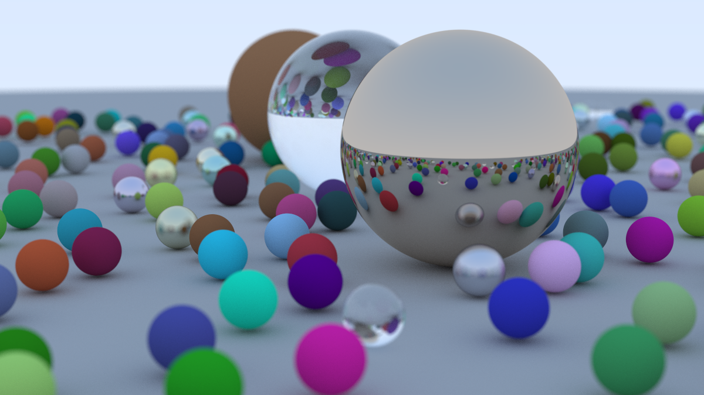
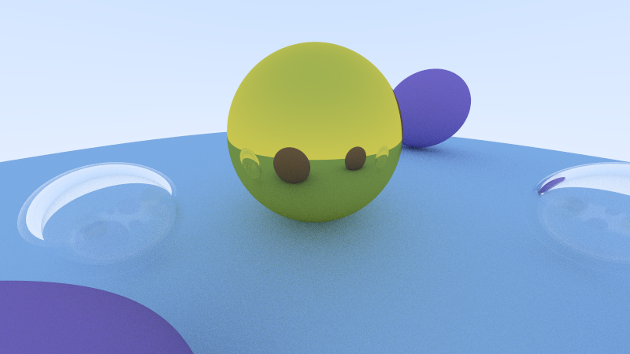

# Ray Tracing in One Weekend Implementation

## Overview

This project is a simple CPU ray tracer implemented in C++ based on the principles outlined in the book [_Ray Tracing in One Weekend_](https://raytracing.github.io/books/RayTracingInOneWeekend.html) by Peter Shirley. This implementation delves into fundamental ray tracing concepts, providing a hands-on exploration of the rendering techniques outlined in the book.

## Requirements
- Microsoft Visual Studio 2022

## Running the Ray Tracer
1. Clone the repository: `git clone https://github.com/MisaelVM/RayTracingOneWeekend.git`
2. Navigate to the project directory: `cd RayTracingOneWeekend`
3. Open the solution `RayTracingOneWeekend.sln` with Visual Studio
4. Run the project

## Examples

## Acknowledgments
Implementation is based on the book [_Ray Tracing in One Weekend_](https://raytracing.github.io/books/RayTracingInOneWeekend.html) by Peter Shirley.
